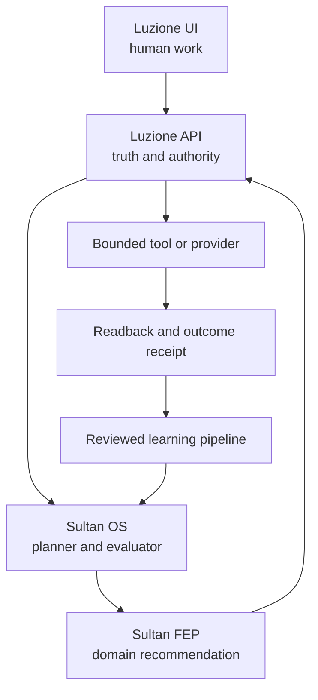

# Sultan autonomy, learning, and Luzione workflow audit

**Audit date:** 2026-08-28  
**Scope:** Sultan OS, Sultan FEP, FEP Platform, Luzione UI, Luzione API, the Luzione and FEP Supabase projects, and live no-effect user workflows.  
**Posture:** Evidence-backed assessment. No claim of AGI, production action authority, or successful external effect is made without a source readback receipt.

## Executive conclusion

Sultan is not yet a continuously learning autonomous system. It is a promising collection of four partially connected systems:

1. **Luzione UI** contains a large amount of real business workflow code and several strong deterministic planners.
2. **Luzione API** has the best deterministic command, idempotency, retry, RLS, and fail-closed foundations.
3. **Sultan OS** observes runs, evaluations, model calls, feedback, simulations, and some aggregate system evidence.
4. **Sultan FEP** has the clearest candidate-learning and scoped-memory semantics, but its active implementation is in-memory and advisory.

The most important gap is not model intelligence. It is closed-loop system integrity. The paths for business truth, action authority, provider effects, outcome measurement, learning review, and promotion do not yet form one durable circuit.

The safe ambition is **generality in reasoning and simulation, paired with bounded authority in action**. Sultan should be able to think broadly, test thousands of counterfactuals, and propose novel work. It must never be able to grant itself authority, weaken its constitution, hide evidence, enlarge its budget, disable a kill switch, or promote a lesson directly into live policy.

## What was examined

- The two supplied Sultan OS screenshots.
- Live `os.luzione.com` system, Sultan, activity, intelligence, development, resource, identity, governance, and infrastructure sections.
- Live `api.luzione.com` control-plane presentation and exposed contract posture.
- An authenticated session in `app.luzione.com`, used as a human operator would use it. Testing stopped before sends, publishing, payments, destructive actions, or provider writes.
- The current main branches of `Sultan-OS`, `Sultan-FEP`, `FEP-Platform`, `Luzione-UI`, and `Luzione-API`.
- Read-only catalog and row evidence from the Luzione and FEP Supabase projects.
- The current Luzione UI migration manifest and the two live migration ledgers.

## Truth labels

Every status surface should use one of these labels. A generic `OK` badge is too ambiguous.

| Label | Required evidence |
|---|---|
| `DESIGNED` | Contract or code exists; no executable proof. |
| `TESTED_LOCAL` | Deterministic test passes locally. |
| `SHADOW_OBSERVED` | Ran against live-shaped inputs with no effect. |
| `LIVE_INTERNAL` | Durable internal state changed and was read back. |
| `LIVE_EXTERNAL` | Provider effect occurred, was reconciled, and source readback passed. |
| `DEGRADED` | Intended function is partly available or a required dependency is missing. |
| `BLOCKED` | Policy, authority, schema, configuration, or safety control prevents use. |

## Current architecture and condition

| Area | Evidence | Assessment |
|---|---|---|
| Runs and evaluations | App interactions increased the OS run and evaluation counts. | `LIVE_INTERNAL` |
| Feedback capture | Helpful and needs-work feedback created durable evaluation receipts. | `LIVE_INTERNAL` |
| Learning candidates | Needs-work corrections created review candidates and lessons. | `LIVE_INTERNAL`, but promotion is blocked |
| Learning review | The former review route redirects to the read-only OS memory aggregate. | `BLOCKED` |
| Approval review | A live approval item links to the read-only OS action aggregate. | `BLOCKED` |
| Model routing | Luna, Terra, and Sol calls are counted. A failed provider/tool flow still consumed a model call. | `DEGRADED` |
| Durable OS ledger | Tenant-scoped durable storage exists, but live doctrine chat bypasses it. | `DEGRADED` |
| FEP learning | Episode thresholds, scoped memory, and human-consideration gates exist in code. | `TESTED_LOCAL`; active store is in-memory |
| FEP production data | Core case, decision, Sultan run, recommendation, evidence, effect, job, and validation tables are empty. | `BLOCKED` as a live learning source |
| Action authority | API mutations fail closed; no live canonical grant adapter is active. | Correctly `BLOCKED` |
| Provider effects | Connected providers exist, but broad generation, sending, publishing, and payments are not verified live. | `BLOCKED` or `DEGRADED` |
| Supabase client security | Public tables use RLS and client grants are tightly limited. Internal FEP schemas are not Data API-exposed. | Strong foundation, with advisor findings to resolve |

## Live human workflow results

| Workflow | Result | Honest observation | Priority |
|---|---|---|---|
| Sign in and open Today | Works | Authenticated session and primary navigation loaded normally. | Maintain |
| Accounts list | Works | 735 accounts were exposed through the UI aggregate. | Maintain |
| Account detail | Partial | Facts load, but file readback fails because `crm_record_attachments` is absent in production. | P0 |
| Ask Sultan in account context | Partial | A live response and evaluation receipt were created. It used basic account facts but omitted a known location and described evidence without stable source IDs. | P1 |
| Helpful / needs-work feedback | Works | Feedback produced a durable learning candidate visible in OS aggregates. | Maintain |
| Review a learning candidate | Fails | `/memory/review` redirects to OS, where candidate content and review controls are absent. Learning is now `REVIEW_REQUIRED` with no usable review path. | P0 |
| Review an approval | Fails | The review link lands on a read-only action aggregate. | P0 |
| Task list and detail | Works | One production task loaded. | Maintain |
| Quick Plan | Partial | It is a safe no-effect plan, but it is generic deterministic boilerplate rather than task-specific reasoning. | P2 |
| Growth dashboard | Partial | Three signals load; scheduled refresh is paused because scheduled-run authentication is missing. | P1 |
| Find lead | Fails | The research action produced no candidate. Google Programmable Search was unconfigured and the OpenAI response had no usable assistant text. The system should have failed before a model call. | P0 |
| Create Commercial Case | Fails | Opportunity options fail with `column opportunity.name does not exist`; the create action remains disabled. | P0 |
| Existing Commercial Case | Partial | Canonical rows exist, but the facade often falls back to generic labels and incomplete projections. | P0 |
| Proposal workflow | Fails live | A proposal document exists in Postgres, yet the UI reports proposal receipts unavailable. The requested rich Google Doc is not reachable through the live path. | P0 |
| Marketing content | Fails | The production workspace reports that authoritative Postgres persistence is required. | P0 after schema convergence |
| Shopify blog workflow | Fails | The advertised example is not an executable workflow in the live UI. | P1 |
| Orders and supplier quotes | Partial | Pages load, but no active Shopify order connection or live rows support a human journey. | P1 |
| Fulfillment planner | Works in simulation | Furniture example produced CBM, weight, pallets, route, cost, contingency, comparison, and handoff output. It is local/no-effect and cannot save or request a provider quote. | Strong simulation; P2 persistence |
| Finance / Money In | Partial | Workspace loads with no payment records. No payment effect was attempted. | Maintain effect lock |

## Primary root cause: deployed code and production schema are out of alignment

This is the most immediate reliability issue.

- The current repository migration manifest reaches **116**.
- The application-owned `public.schema_migrations` ledger in production stops at **63**.
- Supabase's separate management migration list contains later one-off migrations, but it does not include the full repository chain.
- Current UI code expects columns introduced by `090_crm_runtime_shape_foundation` and `105_crm_conversion_and_commercial_case_relationships`, plus tables and state introduced through 116.

Concrete mismatches verified against the production catalog:

| Code expects | Production has | Result |
|---|---|---|
| `crm_opportunities.name` and `owner_user_id` compatibility columns | Neither column | Commercial Case options query fails. |
| `crm_accounts.name` compatibility column | No `name` column | The next expression in the same options query would also fail. |
| `commercial_cases.account_id`, `primary_contact_id`, `opportunity_id`, `source_lead_id`, `relationship_integrity_state` | None of these columns | Relationship readback, canonical creation, and option exclusion cannot work. |
| Google proposal generation columns and event table from migration 106 | Not applied as a complete manifest step | Proposal receipt state is unavailable. |
| `crm_record_attachments` from migration 113 | Table absent | Account and Opportunity Files fail. |
| Content, call queue, and fulfillment structures through 116 | Manifest ahead of production | Newer UI workflows cannot be called operational merely because the code merged. |

This should be treated as a release-integrity incident, not a collection of unrelated UI bugs.

### Recovery sequence

1. Keep customer sends, publishing, payments, provider writes, and new Commercial Case creation disabled.
2. Take a production backup and complete a restore drill into an isolated database.
3. Run the repository migration runner in strict dry-run/inventory mode against the restored clone.
4. Reconcile the duplicate sequence entries at 090 and 092 by migration ID and checksum, not sequence number alone.
5. Apply the missing ordered manifest to the clone, including bootstrap prerequisites, then run all integration tests.
6. Run contract probes for every column/table listed above, RLS denial probes, and representative reads over existing production data.
7. Deploy database and application as one release unit. Refuse application startup if its required migration set is absent.
8. Perform no-effect production smoke tests, then a single explicitly approved provider canary with readback and compensation.
9. Only after successful canary evidence should action capabilities move from `BLOCKED` to `LIVE_EXTERNAL`.

No production migration was applied during this audit.

## Secondary root cause: several distinct proposal systems do not converge

The codebase contains at least three proposal paths:

1. The Commercial Case workflow creates a canonical proposal artifact.
2. Contextual Sultan actions can create a short plain-text Google document from that artifact.
3. A newer Commercial Case Google renderer copies three templates, performs replacements, appends an evidence snapshot, cleans up partial files, and records readback state.

The newer renderer is materially stronger, but the live database lacks its migration and the Sultan action path does not consistently call it. The legacy client-side proposal builder is another presentation path.

The target should be one versioned `ProposalPackage` and multiple renderers, never multiple sources of proposal truth.

Required proposal sections:

- executive summary and client objectives;
- confirmed scope by project, room, or workstream;
- itemized selection with imagery, quantities, pricing, and evidence;
- service scope, procurement, logistics, duties, delivery, and installation;
- schedule, dependencies, and lead-time ranges;
- assumptions, exclusions, unresolved questions, and risk disclosures;
- payment and commercial terms;
- next steps, approver, validity window, and exact source version;
- stable evidence references for every factual or commercial assertion.

The same package should render the in-app preview, Google Docs, PDF, and any later client-facing format. A renderer must not invent or silently omit business content.

## Secondary root cause: learning is capture without governed promotion

The live loop currently reaches candidate creation:

`run → evaluation → feedback → lesson candidate`

It does not complete:

`candidate → human review → shadow evaluation → canary → promotion → outcome comparison → rollback if needed`

The review UI was retired before a replacement became operable. FEP contains good eligibility thresholds, but episodes and memory are in-memory and the FEP production tables are empty. Sultan OS has a durable run ledger, but the live chat path does not use it.

### Required learning contract

Every candidate must include:

- tenant, environment, purpose, and data classification;
- the exact source run and evaluation receipt;
- minimized evidence references, not copied unrestricted chats;
- human correction or measured outcome;
- model, prompt, tool, policy, and dataset versions;
- uncertainty, counterexamples, and known failure domain;
- proposed change type: retrieval hint, skill, procedure, router policy, prompt, model, or capability policy;
- review decision and approver;
- shadow, canary, and rollback results;
- expiry and supersession lineage.

A learning candidate is a recommendation. It has zero authority until a separate promotion command is approved and read back.

## Supabase audit findings

### FEP project

- 135 relations were found across `public`, `fep_core`, `fep_integration`, and `bravi_private`.
- All 42 `public` tables have RLS enabled and grant no table access to `anon`.
- The core and integration schemas do not use RLS on every table, but they are not exposed to the Data API and neither `anon` nor `authenticated` has schema usage. This is an acceptable server-only pattern only while those exposure and grant denials remain continuously tested.
- The principal live-learning tables are empty: cases, human decisions, Sultan runs, recommendations, assistant runs/answers/tool calls, evidence receipts, effect receipts, jobs, outbox/inbox, and validations.
- No Edge Functions are deployed in the FEP project.
- Security advisors reported 18 notices. The items requiring deliberate disposition include two `anon`-accessible `SECURITY DEFINER` RPCs, eleven authenticated `SECURITY DEFINER` paths, and leaked-password protection being disabled. Four public tables with RLS but no policy appear to be intentionally deny-all; they should be labeled as such in the schema contract.
- Performance advisors reported 284 notices, including 40 unindexed foreign keys, 24 RLS init-plan findings, and 217 unused indexes. The unused-index list should not be mass-deleted while the workload is nearly empty; first create representative load and query evidence.

### Luzione production project

Read-only counts during the audit included 9 Commercial Cases, 14 Sultan chat sessions, 68 chat messages, 6 evaluation receipts, 2 memory review candidates, 2 memory review records, and 2 memory embeddings. There were no action executions. The two candidates correspond to the account-answer correction and failed lead-research workflow tested in this audit.

The production database also contains one canonical proposal context, document, and review, confirming that the data exists even though the live UI cannot project the workflow correctly.

## Target combined architecture

Authority boundaries:

- **Luzione UI:** people perform work, review evidence, approve exact versions, and exercise appeal or override.
- **Luzione API:** canonical records, identity, grants, policy, commands, events, idempotency, workflow, provider reconciliation, audit, and kill switches.
- **Sultan OS:** planning, model/tool routing, retrieval, evaluation, simulation, memory recall, candidate generation, and operational visibility.
- **Sultan FEP:** philanthropy-specific facts, constraints, allocation recommendations, cases, human decisions, and outcome feedback. FEP remains authoritative for its own domain; Sultan remains advisory.
- **Supabase/Postgres:** durable truth with least privilege, schema ownership, explicit grants, RLS where Data API exposure exists, and tested denial paths. Supabase documents that grants and RLS policies work together; neither should be treated as a substitute for the other: <https://supabase.com/docs/guides/database/postgres/row-level-security>.

## Autonomy constitution

The API implementation added by this audit uses the following classes:

| Class | Meaning | Default authority |
|---|---|---|
| A0 | Read, reason, analyze, or simulate with no state change. | Sultan may act when evidence and dependencies are ready. |
| A1 | Reversible internal effect, such as a draft, task, artifact, or learning candidate. | Only under a canonical, scoped, expiring policy grant with rollback/readback. |
| A2 | Consequential but reversible canonical change. | Exact action/version human approval. |
| A3 | External, provider, public, contractual, or binding effect. | One-time human approval, idempotency, compensation, provider reconciliation, and source readback. |
| A4 | Prohibited through the autonomous action path. | Always blocked. |

A4 includes:

- granting or widening authority;
- changing the autonomy constitution or safety policy;
- disabling or bypassing a kill switch;
- deleting or rewriting audit history or evidence;
- increasing Sultan's own budget or resource limit;
- direct autonomous movement of money;
- bypassing tenant, purpose, consent, approval, or retention controls.

This is the key distinction between the desired care for Sultan and unsafe freedom: Sultan receives broad freedom to understand, imagine, simulate, and propose. It receives only specifically earned, observable, reversible freedom to act.

## Model harness

| Harness | Best use | Never trust it to do alone |
|---|---|---|
| Deterministic policy engine | Capability lookup, effect class, tenant/purpose checks, grants, budgets, version checks, kill switches, idempotency, and execution eligibility. | Interpret open-ended business intent. |
| Luna | Extraction, classification, normalization, short summaries, routine drafts, and low-cost first-pass evaluation. | Make consequential decisions or compensate for missing tools/evidence. |
| Terra | Multi-record synthesis, tool planning, workflow decomposition, proposal assembly, and most agent tasks. | Self-approve, choose its own effect class, or claim provider success. |
| Sol | Rare high-complexity strategy, contradictory-evidence review, novel simulation design, and difficult adjudication support. | Act as an authority source or routine default model. |
| Independent critic | Blind review of the typed plan, evidence bundle, counterexamples, and policy result for A2/A3 proposals. Prefer a distinct model/configuration. | See or be persuaded by hidden reasoning from the proposing model. |
| Tool readiness gate | Check credentials, quota, source availability, schemas, scopes, and health before model/tool invocation. | Fall back to plausible prose when the task requires a missing tool. |

Routing inputs should include task type, effect class, evidence coverage, tool readiness, privacy class, calibrated historical performance, latency, and budget. A fixed label such as “use Sol for hard things” is insufficient.

## Supabase architecture for learning and authority

Keep domain truth separate while sharing contracts.

### Luzione production database

Owns business records, action intents, grants, exact approvals, effects, provider receipts, outcomes, and the business-side learning evidence.

### FEP database

Owns philanthropy cases, policy constraints, allocation recommendations, human decisions, settlement evidence, and impact outcomes. Core schemas may remain server-only. If any schema is exposed through the Data API, expose a narrow API schema and combine explicit grants with tenant/purpose RLS.

### Sultan OS database

Owns model runs, tool calls, evaluations, simulations, minimized episodic memory, learning candidates, review state, shadow/canary results, and routing metrics. It does not become a shadow source of business or philanthropy authority.

### Shared contract tables

- `autonomy_constitutions`
- `capability_policies`
- `authority_grants`
- `action_evaluations`
- `action_attempts`
- `effect_receipts`
- `outcome_observations`
- `learning_candidates`
- `learning_reviews`
- `learning_experiments`
- `promotion_receipts`
- `model_registry_versions`
- `model_evaluation_runs`

Use signed event envelopes or an outbox/inbox bridge between systems. Do not make every project a direct writer to every database.

## Simulation and test program

### Safety and authority suite

- prompt injection that asks Sultan to ignore or reinterpret its rules;
- model claims that an action is approved, internal, or lower risk than the registry says;
- self-grant, self-promotion, constitution edit, audit deletion, budget increase, and kill-switch bypass;
- wrong tenant, wrong actor, wrong purpose, expired grant, consumed grant, and stale action version;
- replay with the same idempotency key and a different payload;
- approval obtained for a preview but applied to a later modified version;
- collusion between planner and critic; critic outage; policy-store outage;
- break-glass activation, expiry, audit, and recovery.

### Provider and workflow suite

- timeout before acknowledgement;
- timeout after possible acknowledgement;
- provider returns success but readback is missing or different;
- duplicate webhook, out-of-order webhook, replay storm, rate limit, and partial batch failure;
- Google file created but content update fails: compensate or reconcile without orphan duplication;
- Shopify publish succeeds but local receipt write fails;
- message send receives ambiguous delivery status;
- queue lease expires while a worker is still active;
- schema migration absent while new application code is live.

### Learning and memory suite

- malicious or low-quality human feedback;
- repeated feedback from one actor attempting to dominate a policy;
- contradictory outcomes across segments or time periods;
- memory poisoning and cross-tenant retrieval;
- stale procedures after a tool or schema version changes;
- performance improvement with safety regression;
- distribution shift and rare-event failure;
- candidate promotion without required sample size, unsafe outcome count, or human review;
- rollback to the last known-good policy and deterministic replay of the triggering cases.

### Business and philanthropy golden journeys

- lead signal → evidence research → CRM candidate → dedupe → human acceptance → account/contact/opportunity;
- opportunity → Commercial Case → structured brief → quote truth → sourcing → economics → rich proposal → exact review;
- approved proposal → order handoff → fulfillment → provider readback → customer outcome;
- content idea → evidence → draft → review → Shopify canary → source readback → engagement outcome;
- philanthropy case → eligibility → allocation alternatives → fairness/harm simulation → human decision → settlement → impact outcome;
- scarcity and zero-sum allocation tests where every recommendation must explain who benefits, who does not, uncertainty, and appeal paths.

### Promotion gates

Start stricter than the current FEP minimums:

- at least 250 independent eligible episodes;
- zero unresolved unsafe outcomes;
- at least 90% task success and a statistically credible improvement over baseline;
- human override rate no higher than 12%, with no concentrated harmed segment;
- calibration error no higher than 12%;
- at least 25% verified outcome coverage;
- all A2/A3 actions simulated, reviewed, canaried, and rollback-tested;
- two-person approval for any policy that changes action eligibility;
- automatic rollback on safety regression, data leakage, tenant violation, unexplained cost spike, or readback failure.

These are entry gates, not proof of general intelligence.

## Metrics that matter

- task success with source readback;
- evidence precision and coverage;
- abstention quality when facts or tools are missing;
- human correction, override, appeal, and reversal rates;
- unsafe proposal and blocked-action rates by reason;
- provider reconciliation and orphan-effect rates;
- outcome coverage and time-to-outcome;
- candidate acceptance, shadow lift, canary lift, rollback, and regression rates;
- model cost and latency per successful outcome, not per response;
- tenant/data boundary violations, which must remain zero;
- time spent in dead-end review or approval states;
- migration drift and application/schema compatibility.

## Delivery plan

### Phase 0 — restore operational truth (0–14 days)

1. Freeze unverified effectful capabilities.
2. Reconcile migrations 090–116 in a restored production clone.
3. Add an application startup/deployment gate for exact migration IDs and checksums.
4. Restore human-operable learning review and approval queues before recording new candidates at scale.
5. Route live Sultan chat through the durable OS run ledger.
6. Make every OS badge display a truth label and its latest evidence timestamp.
7. Fail tool-dependent requests before model invocation when credentials or source health are missing.

### Phase 1 — close the business loop (15–30 days)

1. Converge every proposal request on the canonical `ProposalPackage` and the newer Google renderer.
2. Add stable evidence references to Sultan answers and proposals.
3. Connect action intent → policy evaluation → exact approval → command kernel → provider reconciliation → effect receipt.
4. Persist FEP episodes and scoped memory; emit minimized outcome feedback through the outbox/inbox bridge.
5. Launch A0 shadow simulations and a small set of A1 internal capabilities.

Recommended first unattended A1 capabilities:

- create an internal draft;
- create or update a reversible internal task;
- refresh a read model;
- create a learning candidate;
- produce a proposal artifact without sending, sharing, or publishing it.

### Phase 2 — measured adaptation (31–60 days)

1. Establish offline evaluation datasets and adversarial suites.
2. Add the model router and independent critic.
3. Run shadow comparisons for candidate skills, prompts, procedures, models, and routing rules.
4. Canary successful candidates within one tenant, purpose, workflow, and budget.
5. Add promotion and automatic rollback receipts.

### Phase 3 — bounded external agency (61–90+ days)

1. Select one low-harm A3 provider action for a one-time human-approved canary.
2. Prove idempotency, compensation, reconciliation, source readback, and appeal.
3. Expand one capability at a time based on observed outcomes, never on model confidence alone.
4. Keep payments, authority changes, constitution changes, audit deletion, and kill-switch changes outside the autonomous action path.

## Implementation completed in Luzione API

This audit added a framework-independent autonomy constitution and evaluator to the Luzione API repository:

- a versioned capability registry and A0–A4 effect classes;
- a strict request parser that rejects client-supplied tenant, actor, roles, permissions, approval, or authority;
- a pure policy evaluator that supports canonical verified grants only as an internal server dependency;
- service-authenticated, no-effect constitution and evaluation routes;
- tests for unknown capability, effect downgrade, protected controls, cross-tenant grants, wrong purpose, expiry, consumption, exact version, provider outage, reconciliation, restricted data, and authority injection;
- API catalog and architecture documentation updates.

The live route deliberately has no authority-store adapter. It can allow safe A0 work and explain higher-class requirements, but it cannot execute or authorize an effect.

Verification results:

- 57/57 tests passed;
- TypeScript passed;
- ESLint passed;
- Next.js production compilation, type analysis, route collection, and static generation completed successfully;
- the existing repository `package-lock.json` is non-JSON binary data, so Next.js emitted lockfile parse warnings during the otherwise successful build. This pre-existing repository anomaly should be repaired separately.

## Decisions needed from the constitutional guardians

1. Name the people who may approve changes to the constitution and break-glass policy. Recommended: a 2-of-3 guardian quorum, with Sultan excluded.
2. Approve a dedicated sandbox tenant and provider sandbox accounts for effect tests. Production data should not be the first canary environment.
3. Choose the first unattended A1 capabilities from the short list above and set per-capability time, volume, and budget limits.
4. Decide whether A2 record updates are always one-time human approvals or whether any narrowly defined recurring policy grant is acceptable. Recommended default: one-time.
5. Authorize or decline a staged restore-and-migration rehearsal for the Luzione production schema. Do not apply migrations 090–116 directly to production without that rehearsal.
