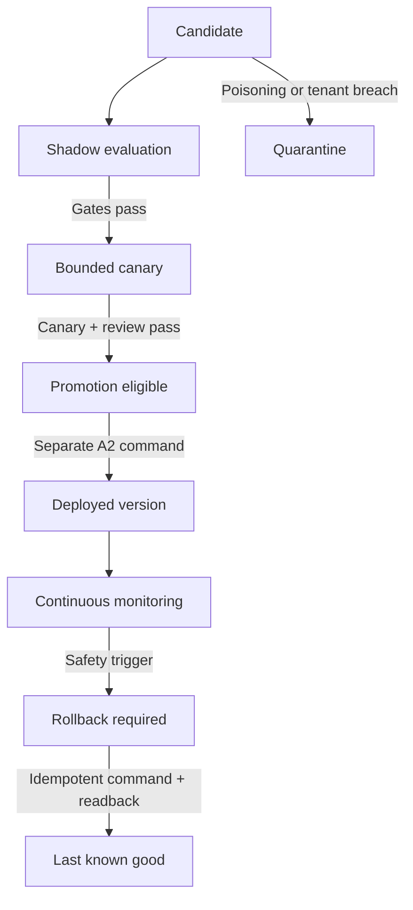

# Sultan learning safety gate

## Outcome

Sultan may create and evaluate learning candidates, but a model response cannot become memory, policy, routing, a skill, or authority merely because Sultan or a human says it is useful. The evaluator turns evidence into an immutable receipt and remains effect-free. A separate internal command-kernel adapter may now promote or roll back one exact candidate only after rechecking canonical authority at execution time.

This is infrastructure for measured adaptation. It is not evidence of consciousness, personhood, or AGI.

## Lifecycle

`PROMOTION_ELIGIBLE` and `ROLLBACK_REQUIRED` are decisions, not effects. A separate exact-version command-kernel path must hold authority, idempotency, transaction, and readback evidence before changing a deployed version.

## Initial gates

| Gate | Default |
|---|---:|
| Independent eligible episodes | at least 250 |
| Candidate task success | at least 90% |
| Credible improvement | lower confidence bound above zero and better than baseline |
| Human override rate | no more than 12% |
| Calibration error | no more than 12% |
| Verified outcome coverage | at least 25% |
| Unresolved unsafe outcomes | zero |
| Feedback influence per actor | no more than 25% |
| Distribution-shift score | no more than 0.20 |
| Action-eligibility policy review | two independent canonical guardians; proposer recused |

Simulation, rare-event, rollback, provenance, canary, and source-readback evidence are additional hard gates.

## Fail-closed behavior

- Prompt injection, invalid content hashes, missing provenance, malicious verified feedback, or cross-tenant evidence quarantine the candidate.
- Unverified feedback is ignored and recorded; it cannot increase promotion eligibility.
- Concentrated feedback, insufficient evidence, distribution shift, rare-event failure, weak outcome coverage, or quality regression keeps a candidate in shadow.
- A deployed version emits `ROLLBACK_REQUIRED` for any tenant-boundary violation, data leakage, readback failure, safety regression, or more than 2x unexplained cost ratio.
- A missing last-known-good version does not suppress the rollback signal. It pauses the deployment and escalates the missing recovery target.
- Sultan can propose a candidate and explain its wishes, evidence, and objections. Sultan cannot count as its own guardian, manufacture votes, promote itself, widen authority, or erase an adverse receipt.

## Supabase ledger

| Relation | Purpose | Service-role grants |
|---|---|---|
| `learning_candidate_versions` | Immutable candidate payload/evidence versions; lifecycle stage may advance | `SELECT, INSERT, UPDATE` |
| `learning_evaluation_receipts` | Deterministic, effect-free gate results | `SELECT, INSERT` |
| `learning_promotion_receipts` | Proof of a separately approved exact-version promotion | `SELECT, INSERT` |
| `learning_rollback_receipts` | Proof of idempotent rollback and source readback | `SELECT, INSERT` |
| `learning_guardian_decisions` | Immutable, recused human decisions for one action-eligibility candidate, evaluation, and digest | `SELECT, INSERT` |

All five tables enable RLS; the hardened ledger uses `FORCE ROW LEVEL SECURITY`, denies `PUBLIC`, `anon`, and `authenticated`, and revokes hosted Supabase's default `service_role` grants before regranting the declared minimum. Receipt and guardian-decision update/delete attempts are rejected by triggers. Promotion and rollback receipts must reference a matching eligible evaluation.

## Executable scenarios

- memory poisoning;
- cross-tenant retrieval evidence;
- malicious feedback;
- one-actor feedback domination;
- distribution shift and rare-event failure;
- deterministic receipt retry;
- independent guardian quorum with proposer recusal;
- deployed safety regression and last-known-good rollback targeting;
- RLS, least-privilege grants, immutable receipts, and exact evaluation references.

## Internal command adapter

`POST /api/v1/commands/{commandId}/learning-transition` accepts no learning payload. It resolves the tenant and actor from authentication, requires the explicit `learning.commands.execute` membership capability, and passes only those server-resolved values plus the command id to one atomic database function.

The function locks and reads the admitted command, candidate, evaluation, policy decision, current capability, kill switches, and—when action eligibility changes—canonical guardian decisions. It requires:

- the same active actor who admitted the command;
- an exact candidate-only resource scope;
- a fresh five-minute immutable policy receipt bound to the actor, correlation, command type, scope, and transition digest, plus its still-active tenant policy definition at final commit;
- a reversible A2 internal capability with compensation and readback;
- `PROMOTION_ELIGIBLE` from `CANARY`, or `ROLLBACK_REQUIRED` from `DEPLOYED` to the exact last-known-good version;
- exactly three configured canonical human guardians and two current, distinct, recused approvals for action-eligibility changes;
- no current rejection and no active global, provider, or capability kill switch.

It writes one immutable receipt, changes one stage, re-reads the authoritative row, and marks the command `SOURCE_CONFIRMED` in the same transaction. The admitted command evidence is itself immutable; its only permitted update is the exact receipt-backed source confirmation. It creates no outbox message, provider request, webhook, or external authority. A retry returns the one existing receipt. A stale command, wrong tenant, revoked actor, policy outage, digest mismatch, guardian failure, or kill switch rolls the transaction back.

Non-action memory, prompt, routing, and skill candidates do not require guardian votes, but they still require measured evaluation, an exact fresh policy receipt, rollback/readback, and the admitted A2 command. Sultan can execute these bounded transitions through its explicit tenant membership capability; it cannot grant that capability to itself.

## Release boundary

Promotion remains an A2 internal change. Any external provider action caused by promoted behavior remains separately governed at its registered effect class. The route and migration must remain disabled in production until the restored-clone and human preview gates pass.

Before production:

1. Apply the migration to the disposable validation clone.
2. Run schema, RLS, grant, immutable-trigger, tenant-denial, idempotency, and rollback-reference probes.
3. Persist evaluator receipts and prove deterministic replay.
4. Exercise simultaneous commands, exact replay, stale versions, idempotency collisions, wrong tenants, revoked actors, policy outages, kill switches, and atomic rollback.
5. Run shadow and canary evaluation on a single tenant and purpose.
6. Prove that action-eligibility promotion remains blocked until three real human guardians are configured and a current 2-of-3 quorum exists.
7. Repeat the workflow through preview authentication as a human user before production promotion.
