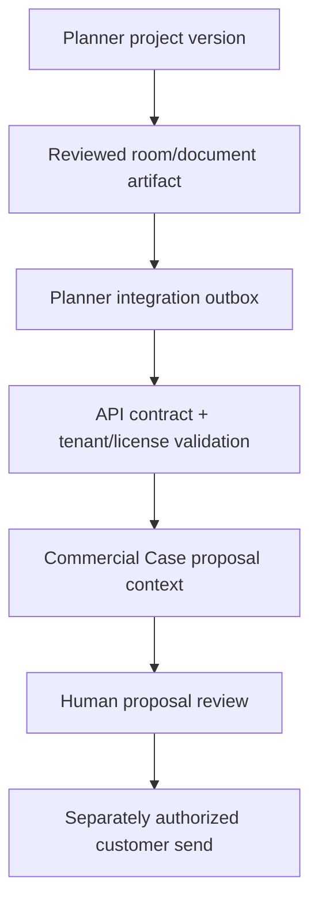

# Luzione Production Readiness and Productization Audit

Date: 2026-09-01 UTC  
Scope: Luzione UI, Luzione API, Sultan OS, Luzione Room Planner, their Vercel deployments and their managed Supabase estates  
Candidate: `CIBOTFLOW/Luzione-API@4ebc4b9280b480ba789712b29b4e84400663456b`  
Decision: **NOT PRODUCTION READY**

## Executive decision

The customer-facing CRM shell is materially functional, the API has strong fail-closed architecture in source, and Sultan exposes useful operator evidence. The combined system is nevertheless not safe to certify for production customers. Four hard blockers dominate the decision:

1. The Room Planner managed database has a critical access-control posture: 28 of 29 public tables have RLS disabled, and all 29 grant broad table privileges to `anon`, `authenticated` and `service_role`.
2. The Room Planner production application currently fails at `/app` and its deployment is not bound to a discoverable Git SHA.
3. The API production database has not converged to the repository's migration and least-privilege model. The security gate returns 503, one expected table is absent, and the release advertises only two applied schema versions.
4. No exact-version cross-system journey, canary/rollback, managed restore or production observation package certifies UI → API → Sultan/worker → source readback.

This is a bounded, non-destructive assessment—not a penetration-test certificate. No production data was mutated, no provider effect was authorized, and no production migration was applied.

## System scorecard

| System | Observed production identity | What works | Production blockers | Decision |
|---|---|---|---|---|
| Luzione UI | `ea8da2e4d80557f03bf6e72ec93b294eaf603f48`, `dpl_J5RgW7EjALzmiNr5pGghibFka1JH` | Authenticated Today, Growth, Accounts, Commercial Cases, Orders and Money surfaces rendered. Proposal flow is governed and human-reviewed. | Runtime DDL in canonical DB logs; two 300-second property-signal timeouts; Shopify reconciliation error; prebuild covers only part of the repository suite inventory; no cross-system certificate. | Functional core, not certified |
| Luzione API | `1d4e61b6a402cde0e7319f17895dac2881cb434e`, `dpl_6nF6Dev39NCXtereDBb2XNrcLChJ` | Liveness passes; mutations and effects fail closed; exact release identity is exposed. | Security health 503; 39/40 expected tables; 61 RLS/role violations; only two managed API migrations; safe roles absent; intermittent readiness; DB TLS unverified; project ownership visibility gap. | Blocked |
| Sultan OS | `77c81afd7995581be7d6bb564eb10eceab057290`, `dpl_G3MTEHPda9hnFYZ7ZVC4MtBR4LCa` | Read-only operator plane renders and separates configured from observed state. | Routing success is 20/27 (74.07%); Shopify is stale; document generation/readback unverified; operator auth absent; sampled traffic is too sparse for reliability claims. | Degraded, not certified |
| Room Planner | deployment `dpl_GH7aH7ALxEvDeyNVgEprX3tgKf9J`; no Git SHA provenance | Source model has versionable Project, Room, Concept, GeneratedDocument and IntegrationOutbox primitives. CI includes a disposable DB and lockdown validation. | `/app` is broken; seven sampled 500s; critical managed RLS/grant failure; migrations lag source; runtime/CI Node drift; no exact-source deployment. | Critical block |

## P0: actions required before any customer pilot

### 1. Contain and repair the Room Planner data boundary

Treat this as a potential exposure condition, not proof that data was accessed.

- Immediately restrict or disable the exposed Data API surface until the privilege path is understood.
- Revoke broad privileges from `anon` and `authenticated`; grant only the minimum statements to purpose-built roles.
- Enable and force tenant RLS on every tenant-bearing public table, including `Project`, `Room`, `Asset`, `GeneratedDocument`, `IntegrationOutbox`, `OperatorGrant` and session data.
- Run anonymous, authenticated, missing-tenant and cross-tenant negative probes against a managed preview and then production.
- Review database/API access logs for unauthorized enumeration or writes.
- If session or Shopify secrets could have been read through the exposed shape, rotate them after containment and invalidate affected sessions.
- Apply a checksummed, idempotent lockdown migration with a tested rollback/readback plan. CI success against a disposable database is not evidence that the managed database converged.

### 2. Repair and provenance the Room Planner deployment

- Fix session-table bootstrap, invalid UUID handling and the `/app` error boundary.
- Remove runtime schema bootstrap; migrations must create the session and application schema.
- Deploy only from a reviewed Git commit and publish repository, SHA, migration set, build time and deployment ID.
- Require preview journey, security negatives and rollback before promotion.

### 3. Converge the API managed database

At 2026-09-01T06:39:35Z, `GET /api/v1/healthz` returned 503 `SECURITY_POSTURE_REQUIRED`, 40 expected tables, 39 observed and 61 violations. `order_fulfillment_intents` is missing. The production release reports `DEPLOYED_INCOMPLETE` and only:

- `20260828210000_tenant_ai_governance_and_workflow_packs`
- `20260828213000_workflow_pack_foreign_key_indexes`

The repository contains later command, workflow, proposal, order, worker and least-privilege migrations. Apply them first to an exact preview candidate; create the non-login runtime/worker roles; prove grants, forced RLS, tenant denials and authoritative readback; rehearse rollback; then canary UI and Sultan consumers. Do not weaken `healthz` to make the deployment appear green.

### 4. Stabilize dependency readiness

`GET /api/v1/readyz` returned both 200 and 503 in bounded, low-volume observations. A later 200 reported database latency of 35.1 ms but total request observations were several seconds, and earlier samples failed `DB_UNAVAILABLE`. Correlate Vercel cold starts, pool acquisition, pooler behavior and managed database logs. Certification needs a sustained exact-release window, not one green response.

## P1: production-grade gaps

### Runtime schema ownership

Canonical Postgres logs contained 34 `create table if not exists` statements in the sampled 24-hour window: 30 for `manual_connector_credentials`, two for `sultan_chat_messages` and two for `sultan_chat_sessions`. Request paths should never own schema convergence. Move these objects to owned migrations and make the application fail closed when a required migration is absent.

### Durable long-running work

The UI property-signals cron timed out twice at the 300-second limit. Convert it into a restart-safe queued workflow with checkpoints, idempotency, bounded retry, dead-letter handling and reconciliation. A timer-triggered monolith is not a production growth engine.

### Sultan reliability and provider proof

The live API readback reported Sultan `DEGRADED`: 20 successful model calls from 27, Shopify stale, Google Docs configured but generation unverified, and operator authentication unavailable. Set a release threshold, collect a representative window, test provider slowdown/rate limits/ambiguous outcomes, and prove generated artifacts through authoritative readback. Four sampled 200 requests over 24 hours are not meaningful reliability evidence.

### Universal release gate

Each repository needs one mandatory, exact-head gate covering typecheck, lint, all tests, migration fresh/upgrade proof, dependency audit, secrets scanning, production build, browser smoke, security denials and contract compatibility. Optional live/model/provider campaigns must remain separate but required before the capability they protect is promoted.

### Recovery and observability

No managed backup/PITR exercise, exact-RPO/RTO measurement, alert delivery test, preview rollback or production canary is bound to this release set. These are release evidence, not documentation tasks.

## Product shape for Luzione Technologies

The product catalog now defines three customer profiles—international distributor, procurement shop and design firm—and four licensable editions:

| Edition | Product promise | Included foundations |
|---|---|---|
| AI Operating CRM | AI-assisted relationship and revenue operations | Supplier, leads, accounts/opportunities, growth, money, orders, tasks, support, quotes and governed AI |
| International Import Operations | Europe-to-USA commercial and fulfillment operations | Supplier, CRM prerequisites, orders, shipping, fulfillment quoting, trade review, provider network, white-glove scheduling and quotes |
| Design Commerce | Client pursuit through reviewed design proposal and delivery | Supplier/CRM prerequisites, orders, shipping/provider prerequisites, tasks, proposals, quotes, room planning and white-glove delivery |
| Luzione Enterprise | Complete operating system | All 17 modules |

The exact module catalog covers:

1. Supplier onboarding
2. Lead management
3. Accounts and opportunities
4. Growth engine
5. Money dashboards
6. Orders and delivery
7. Task management
8. Customer experience and support
9. International shipping and logistics
10. End-to-end fulfillment quoting
11. Import/export rules and documents
12. Service-provider mapping and management
13. AI operating system
14. White-glove delivery scheduling
15. Proposal generation
16. Quote generation
17. Room planner

Delivery stages are intentionally honest: existing CRM/commercial foundations are `CONTRACT_FOUNDATION`; shipping, fulfillment quoting and room-plan integration are `INTEGRATION_PENDING`; trade compliance, provider mapping and white-glove scheduling remain `PLANNED` until authoritative data and provider adapters are proven.

## Licensing foundation implemented in this candidate

The API candidate now contains:

- `luzione-product-catalog/v0.1`: public segments, editions, modules, dependencies and the two origin-market phases.
- `luzione-tenant-license-entitlement/v0.1`: tenant-bound, exact-version module entitlements and limits.
- A fail-closed license evaluator for contract mismatch, tenant mismatch, stale/invalid snapshots, inactive or expired licenses, duplicate/unknown entitlements and access-mode escalation.
- An append-versioned API-owned license migration with forced RLS, no browser or legacy `service_role` access, and read-only `luzione_api_runtime` grants.
- Credential-bound `GET /api/v1/licensing/entitlements` plus public, non-tenant `GET /api/v1/productization`.

Licensing is deliberately separate from authority: an entitlement can permit a module, but it cannot grant a business role, approve money, send a customer document or authorize an external provider effect.

Still required before commercial activation: persistent credential-to-tenant/customer membership, delegated user identity, pricing/plan policy, provisioning commands, metering, billing provider and webhook reconciliation, trials/grace/cancellation rules, seat enforcement, invoice/tax handling, customer terms/EULA and a managed migration/canary. The current Vercel workload mapping is statically bound to the internal `luzione` tenant; no customer tenant is licensed by this local candidate.

## Room Planner inside a proposal

The correct boundary is an immutable reviewed attachment:

The new `luzione-room-plan-proposal-attachment/v0.1` contract binds tenant, commercial case, proposal-context version, planner project version, rooms, selected products, generated document version, artifact SHA-256 digest and reviewer evidence. It always sets pricing authority, customer-send authority and binding acceptance to false.

The planner should emit `room_plan.proposal_attachment.ready/v1` through its existing `IntegrationOutbox`. The API validates and stores the attachment against the exact Commercial Case proposal context. The UI then renders the plan as proposal evidence before final human review. Quote prices remain sourced from approved supplier/product/economics records; sending and acceptance use their existing governed commands.

## Origin-market rollout

Phase 1 is Italy, Denmark, Portugal, Spain, Türkiye, France and the Netherlands into the United States. Phase 2 is Morocco, India, Sweden, Japan, Vietnam and Germany into the United States.

Do not release a country by adding its code alone. Each origin/destination lane needs an effective-dated data pack with source authority, product classification, origin evidence, restricted-goods checks, customs/document requirements, Incoterms, duty/tax assumptions, broker/forwarder coverage, SLA, exception workflow and named human reviewer. AI may extract, compare and draft; it may not create legal finality.

## Release sequence

1. **Security containment:** Room Planner RLS/grants, session/secrets review, API least-privilege managed preview.
2. **Runtime recovery:** Room Planner `/app`, API readiness, UI runtime DDL and cron redesign, Sultan routing/provider proof.
3. **Foundation release:** review this product catalog/licensing migration; deploy preview only; run exact tenant/security negatives and rollback.
4. **Room-plan vertical slice:** planner outbox → API attachment → UI proposal evidence → human review, with zero pricing/send authority.
5. **Italy-to-USA pilot:** supplier onboarding → opportunity → proposal/quote → accepted order → fulfillment/logistics → white-glove schedule → source readback.
6. **Certification:** exact SHAs, managed migrations, independent consumer tests, canary, rollback, restore, security and SLO windows.
7. **Country expansion:** admit each additional lane only after its data pack and provider coverage pass the same gate.

## Evidence and limitations

Performed: read-only production HTTP probes, authenticated UI/Sultan browser journeys, Vercel deployment/build/log inspection, Supabase schema/privilege/RLS/migration/log/advisor inspection, repository review, and local typecheck/lint/test/build/dependency audit.

Not performed: destructive penetration testing, production writes, provider effects, production load/soak, managed restore/PITR, production migration application or independent consumer implementation of the new contracts.

Machine-readable finding set: `engineering/execution/readiness/API_PC_016_PRODUCTION_READINESS_AUDIT_20260901.json`.
